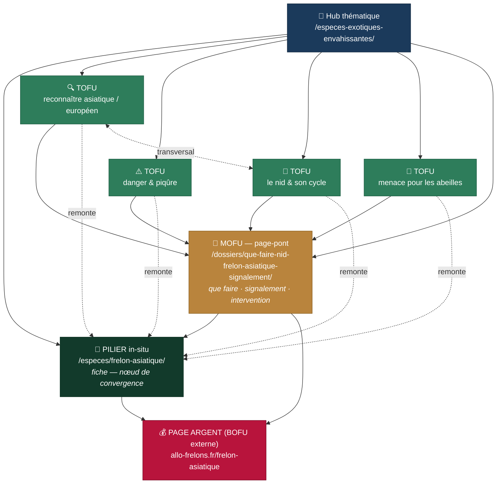

# Cocon sémantique — Frelon asiatique (Vespa velutina)

**Site d'autorité** : observatoire-biodiversite-npdc.fr
**Page argent (BOFU, externe)** : https://allo-frelons.fr/frelon-asiatique
**Persona** : particulier qui vient de repérer / d'apercevoir un frelon ou un nid, inquiet, cherche
d'abord à comprendre (identifier, évaluer le danger) puis à agir (faire intervenir).
**Action de conversion** : faire appel à un professionnel (pages d'intervention Allo Frelons 59/62)
+ transmission d'autorité vers la page argent via le pilier.

> Cocon construit sans export Haloscan, à partir de la connaissance du sujet et du sitemap
> existant. Les volumes de recherche ne sont donc pas chiffrés ici (« non fournis ») ; l'ossature
> repose sur les intentions de recherche connues du domaine.

## Architecture (mind map, colorée par étape d'entonnoir)

## Le parcours de conversion, en une phrase

Une porte d'entrée **TOFU** (l'internaute veut *reconnaître*, *évaluer le danger*, comprendre le
*nid* ou la *menace sur les abeilles*) → descente vers la page **MOFU** *« que faire face à un
nid »* → **conversion** : appel à un professionnel (Allo Frelons 59/62) **et** remontée d'autorité
vers le **pilier** (fiche frelon asiatique) qui transmet le jus à la **page argent** via un lien
d'ancre exacte « frelon asiatique ».

## Les nœuds

| Rôle | Page | Étape | Intention |
|------|------|-------|-----------|
| Pilier (relais BOFU) | `/especes/frelon-asiatique/` | pivot | Le frelon asiatique (espèce) — **à améliorer**, existant |
| Fille MOFU (pont) | `/dossiers/que-faire-nid-frelon-asiatique-signalement/` | MOFU | que faire, signalement, qui appeler |
| Fille TOFU | `/dossiers/frelon-asiatique-ou-europeen-reconnaitre/` | TOFU | différence asiatique / européen |
| Fille TOFU | `/dossiers/frelon-asiatique-danger-piqure/` | TOFU | danger, piqûre |
| Fille TOFU | `/dossiers/nid-frelon-asiatique-reconnaitre-cycle/` | TOFU | reconnaître le nid, cycle |
| Fille TOFU | `/dossiers/frelon-asiatique-abeilles-menace/` | TOFU | impact sur les abeilles |
| Hub | `/especes-exotiques-envahissantes/` | — | dossier EEE (accès menu) |

## Règles de maillage appliquées

- **Descendant** : le pilier (section « Le frelon asiatique en détail ») et le hub EEE lient les 5 dossiers.
- **Montant** : chaque dossier remonte vers le pilier (fiche) avec des **ancres variées** (jamais l'ancre exacte en interne).
- **Chemin de conversion** : chaque page TOFU pousse d'un cran vers la page MOFU ; la MOFU pousse vers l'intervention (pages 59/62) → pas de feuille orpheline.
- **Ancre exacte réservée** : le lien vers la page argent avec l'ancre exacte « frelon asiatique » reste sur le **pilier** uniquement, pour éviter la sur-optimisation.
- **Transversal justifié** : reconnaissance ↔ nid ; abeilles ↔ fiche abeille domestique ; danger ↔ frelon européen.

## Anti-cannibalisation

- La fiche `/especes/frelon-asiatique/` **existait déjà** → statut **« à améliorer »** : elle reste
  le pilier (page espèce, vue d'ensemble), enrichie d'une section liant les dossiers. Les 5 dossiers
  couvrent des **intentions distinctes** (comparaison, danger, nid, abeilles, que faire) et ne se
  cannibalisent pas entre eux ni avec la fiche.
- Chaque intention = **une seule page**.

## Suite possible

- Rédaction fine d'une page à partir d'un export **Thot-SEO** (phase 2 du skill cocon) pour caler
  précisément le champ lexical obligatoire.
- Extension du cocon (frelon européen, guêpes, nids dans un mur/toiture) si les volumes le justifient.
- Déclinaison **omnicanale** (vidéo, infographie, réseaux) via le skill `cocon-omnicanal`.
